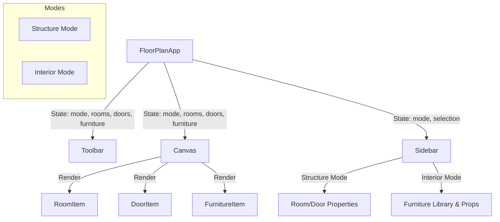

# Interior Design Mode Implementation Plan

## Overview
We are adding a new "Interior" mode to the Floor Plan Creator. This separates structural editing (walls, doors) from interior design (furniture placement), preventing accidental changes to the floor plan while decorating.

## Architecture



## Data Structures

### New Interface: `Furniture`
```typescript
export interface Furniture {
  id: string;
  type: 'bed_queen' | 'bed_single' | 'sofa_3' | 'sofa_2' | 'table_dining' | 'table_round' | 'desk' | 'wardrobe' | 'tv_unit' | 'toilet' | 'sink' | 'shower' | 'plant';
  x: number; // Percentage (0-100)
  y: number; // Percentage (0-100)
  rotation: number; // Degrees (0, 90, 180, 270)
  width: number; // Width in feet
  depth: number; // Depth in feet
}
```

### State Updates
- **`FloorPlanApp`**:
  - `mode`: `'structure' | 'interior'` (Default: `'structure'`)
  - `furniture`: `Furniture[]` (Added to `useHistory` state)

## Component Updates

### 1. `FloorPlanApp.tsx`
- Add `mode` state.
- Add Tab Switcher (Segmented Control) at the top of the `Sidebar` or `Toolbar` (User requested "Tabbed approach", likely meaning a clear mode switch).
- Implement `addFurniture(type)`, `updateFurniture(id, field, val)`, `deleteFurniture(id)`.

### 2. `Sidebar.tsx`
- **Structure Mode**: Show existing Room/Door controls.
- **Interior Mode**:
  - **Furniture Library**: Grid of buttons with icons/labels for adding furniture.
  - **Selected Furniture**: If furniture is selected, show properties (Rotation, Delete).

### 3. `Canvas.tsx`
- **Rendering**: Map over `furniture` array and render `FurnitureItem`.
- **Locking**:
  - If `mode === 'interior'`: Rooms/Doors have `pointer-events-none` or ignore clicks (background remains interactive for panning).
  - If `mode === 'structure'`: Furniture has `pointer-events-none` or ignores clicks.

### 4. `FurnitureItem.tsx` (New)
- Renders distinct SVGs based on `type`.
- Handles Dragging (same logic as Room/Door but updates `furniture` state).
- Handles Rotation (90-degree increments).

## Interaction Rules
- **Structure Mode**: Can add/edit Rooms and Doors. Furniture is visible but locked (ghosted/non-interactive).
- **Interior Mode**: Can add/edit Furniture. Rooms and Doors are visible but locked (act as background). Panning/Zooming works in both.